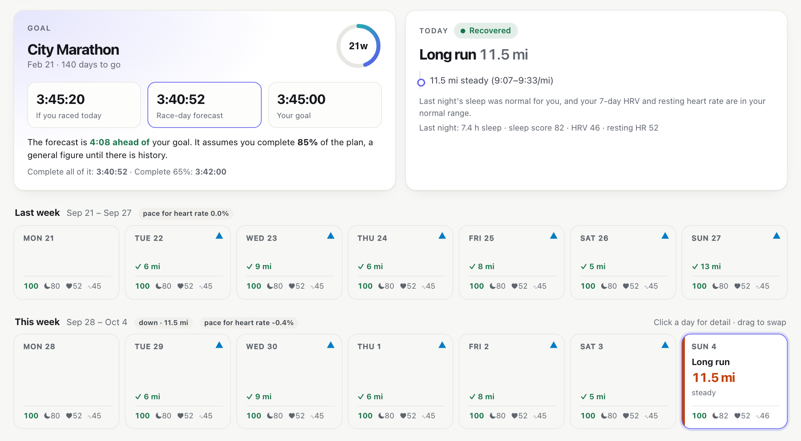
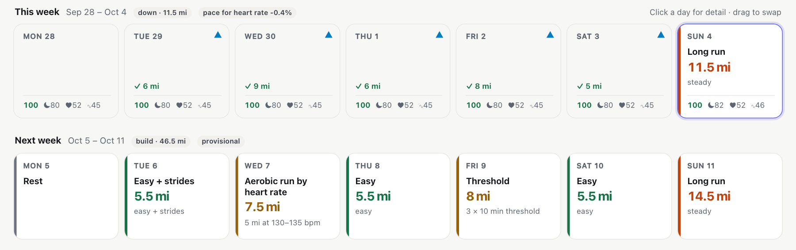
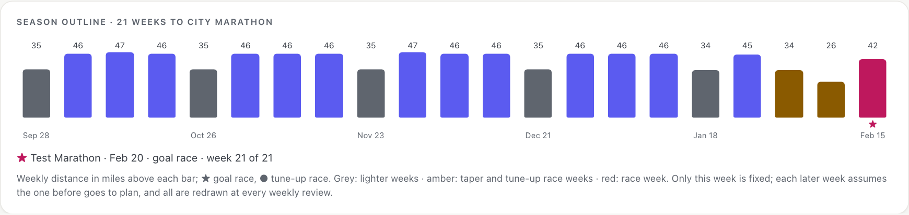
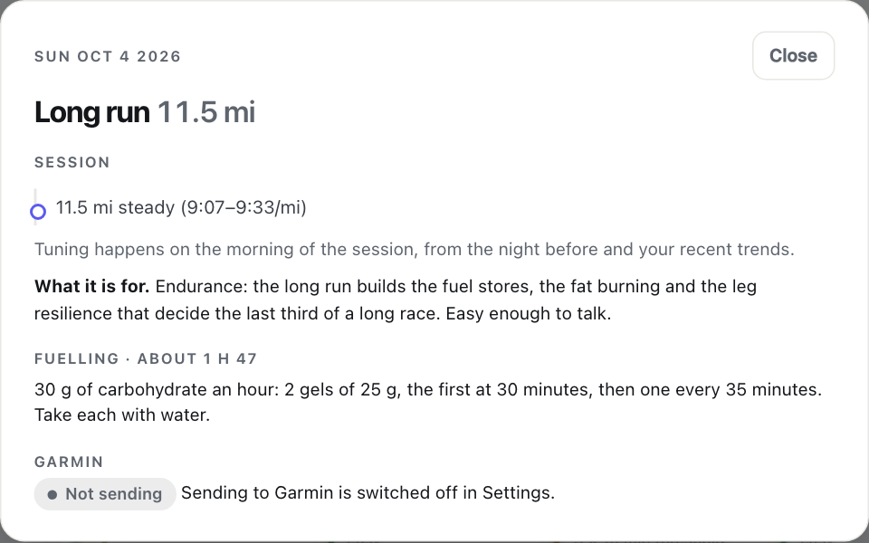
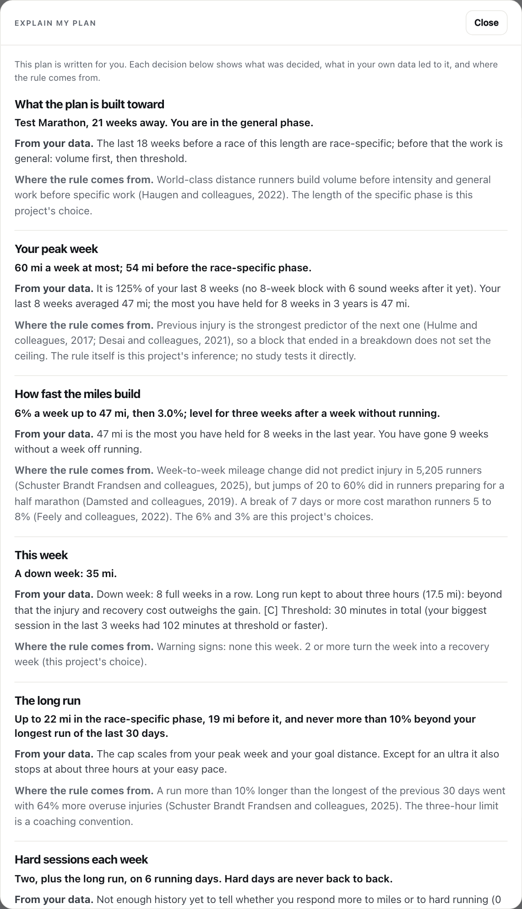
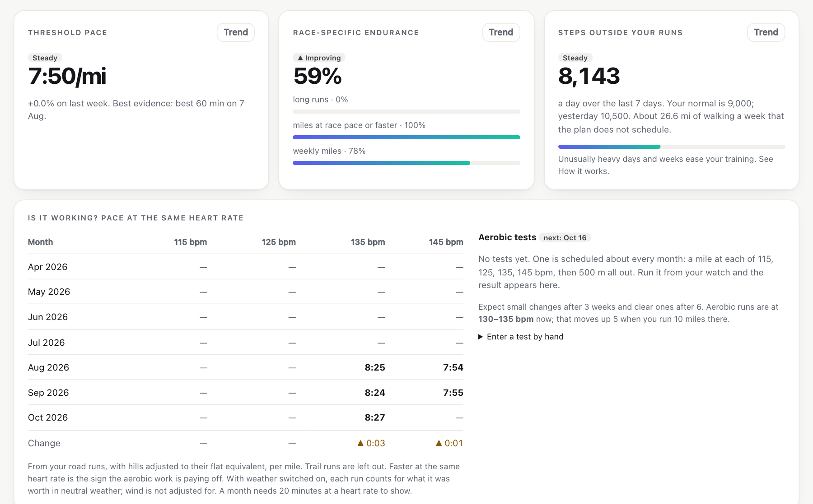
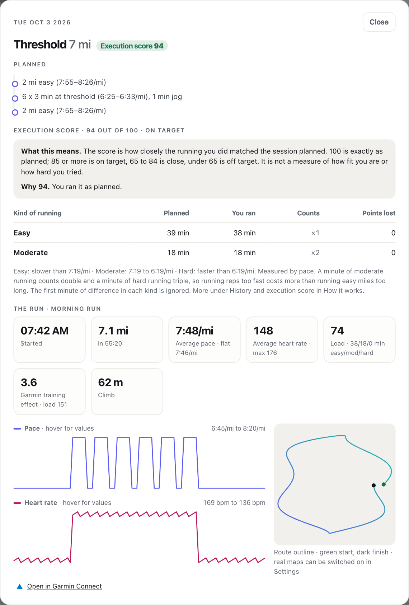
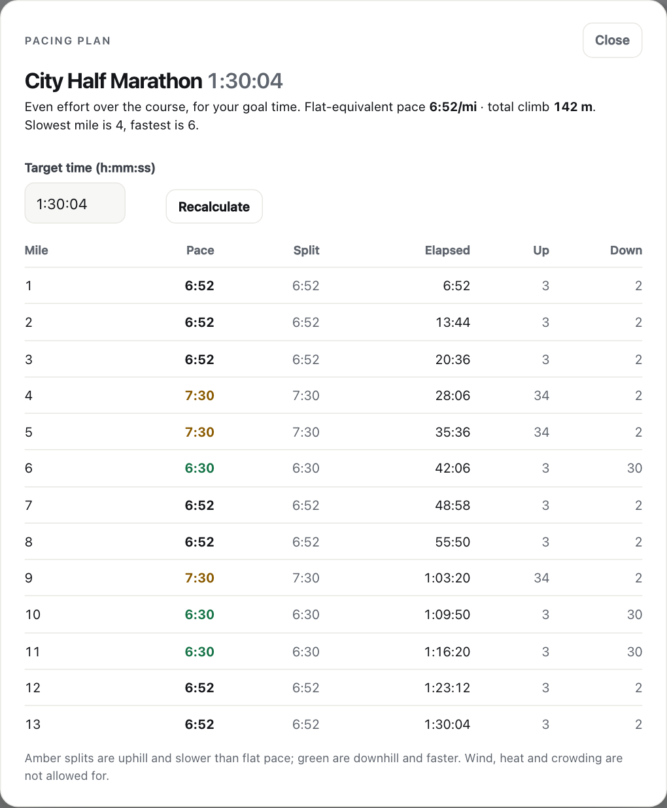
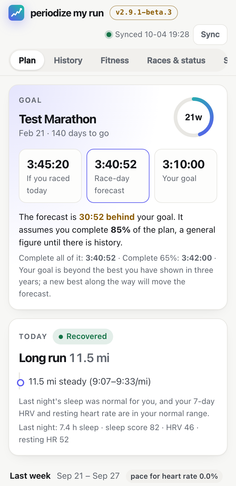

# Periodize My Run

A training planner that runs on your own computer: macOS, Windows, or Linux
(including a Raspberry Pi). It reads your Garmin history, builds a plan toward
your goal race, and keeps adjusting it from what you actually do. No AI is
used when it runs: the rules are ordinary code in `engine.py` and `assess.py`.

> **Before you use it**
> - **Not medical advice.** It is a training tool. See a doctor before starting
>   or changing training, and stop for chest pain, fainting or illness with a
>   fever. You run, and follow any plan from it, **at your own risk**.
> - **Not for the internet.** Run it on your own computer or your home network
>   only. Never forward a router port to it or put it on a public address.
> - **Your data is yours.** Everything stays on your computer, and keeping that
>   computer, your backups and the app password safe is up to you.
> - **No warranty.** It is free software provided as is (see LICENSE), it can be
>   wrong, and Garmin can break the connection at any time. Read
>   [DISCLAIMER.md](DISCLAIMER.md); the app asks you to accept it once.

## What it looks like

All pictures are of the app running with a made-up test athlete.

**The plan.** Your goal and forecast, today's session and how recovered you
are, then each week day by day.

**Weeks ahead and the season.** The next weeks in detail, and the whole build
to race day.

**Every day says what it is for**, with its paces, fuelling and whether it is
on your watch.

**Explain my plan.** Every decision behind the plan, the numbers from your own
data that led to it, and where the rule comes from.

**Is it working?** Threshold pace, race-specific endurance, and your pace at
the same heart rate month by month.

**Each run in detail**, scored against what was planned.

**A pacing plan for a hilly race**, mile by mile at even effort.

**On a phone**, from your home screen.

## Features

**Setup wizard (in the browser, three steps)**
1. Connect your watch: choose Garmin or COROS, then give the email and
   password (and the two-step code, for a Garmin account that uses one).
2. Add your races: a goal race and any tune-up races, from 5K to 100 miles.
3. Say how you train: units, running days, long run day, days you cannot
   run, and whether to send workouts to your watch.

It then reads your history and builds the plan, showing progress as it goes.

**Planning**
- Goals: 5K, 5 miles, 10K, 10 miles, half marathon, marathon, 50K, 50
  miles, 100K, 100 miles, any other distance, or no race at all.
- Personal limits (peak week, longest run, heart rate zones) from your own
  history.
- Paces from your current fitness, updated weekly; they follow you, not
  your goal time.
- Week types chosen automatically: build, down, recovery, return, tune-up
  race, taper, race.
- Sessions that progress one step from what you last completed.
- 3 to 6 running days, any long run day, and days you cannot run.
- Race predictions for today and for full preparation, and a check of how
  accurate past predictions were against your actual races.

**Every day**
- Downloads new runs, sleep, HRV, resting heart rate, weight and steps.
- Eases today's fast running by up to about 5% after poor sleep, low HRV,
  a raised resting heart rate, or a heavy day on your feet.
- Counts steps taken outside your runs as background load.
- Optional daily message with today's session.

**Weather (optional)**
- Switch on weather and every outdoor run is given the temperature, humidity,
  wind and rain it was run in. Fitness, the aerobic tests and the prediction
  check are then judged on what each run was worth in neutral weather.
- Fast paces are eased on hot, humid days, a dangerously hot day becomes an
  easy run, and the race-day forecast appears for your goal race.
- The weather comes from Open-Meteo, which receives only the rough locations
  (to about 10 km) and dates of your runs.

**Explained, and yours**
- "Explain my plan" lists every decision behind the plan, the numbers from
  your own data that led to it, and where the rule comes from.
- Every planned day says what it is for.
- Your peak week comes from what you have held without breaking down, and your
  taper and the balance of miles against hard sessions are learned from your
  own history.
- Every peer-reviewed study used is listed in the app with the principles
  that rely on it (see [PRINCIPLES.md](PRINCIPLES.md)).

**Where your runs come from**
- Garmin (the full connection: runs, sleep, HRV, resting heart rate, steps,
  and workouts sent to the watch).
- FIT files from a folder: exports from COROS, Polar, Suunto, Wahoo or any
  watch, or a folder a sync app fills. Runs only, so there is no day-by-day
  easing from sleep or HRV and nothing is sent to the watch.
- COROS: runs read from your COROS account through COROS's unofficial web
  interface (the one its Training Hub website uses). Checked against a real
  COROS account in Europe: sign-in, the list of runs, the .fit download and
  reading it. Europe, the USA and China are each tried, so it finds your
  account's region itself. Runs only, like a folder of FIT files. It never sends
  anything to COROS. COROS can change or block this interface at any time.

**Your watch**
- The next 21 days (or 7 or 14) kept on the Garmin calendar as structured
  workouts with pace targets, including strength sessions.
- Checked every four hours (around 02:00, 06:00 ... UTC, each check moved by
  up to 30 minutes at random): changed days are re-sent
  and any workout deleted from the Garmin calendar is put back. Your own
  workouts are never touched.

**Control**
- Drag and drop to swap days, with undo and a warning for hard days back to
  back.
- Mark yourself sick or injured; the plan rests you and brings you back.
- Add a holiday and choose how to run while away: no running, easy runs
  only, easy runs and the long run, sessions only, sessions and the long
  run, or as normal.
- Plan against actual, week by week. Weight trend.
- "How it works" page generated from the live rules and your settings.
- Backup download. Activity log.

**Backups and calendars**
- Nightly backups on this computer, kept daily for 7 days, weekly for 4
  weeks and monthly for 3 months, with restore; a secret-free backup to
  download.
- `tools/pull_backup.py`: run on another computer, it fetches a secret-free
  backup each day into a folder that a sync app uploads (Google Drive for
  desktop, iCloud Drive), so there is an off-site copy with no sign-in inside
  Periodize My Run.
- A calendar file for Apple Calendar, Outlook or Google Calendar.

**Running it**
- Installer for macOS and Raspberry Pi; starts at boot and stays running.
- Catches up after downtime; warns after 7 days without a sync.
- Password, login limits and HTTPS for access from other devices.

## How much history it uses

- **Everything, in summary.** One line per activity for every year on your
  account. This is cheap (about one request per 100 activities) and gives
  your best times, your highest sustained mileage, your maximum heart rate
  and your breaks from running. Those set your personal limits.
- **The last 26 weeks, in detail.** Second-by-second files are downloaded
  only for recent runs, because only recent training says how fit you are
  now. Planning itself uses the last 8 weeks.

## Install

It runs on **macOS**, **Windows 10 and 11**, and **Linux** (Debian, Ubuntu,
Raspberry Pi OS, DietPi, or any system with systemd). You need a Garmin account
or a folder of FIT files, and the internet for the install. Python 3.12 or later
is used if you have it and downloaded for the app if you do not.

The steps are the same on every system: get the files, run the installer, open
the app in a browser. The installer makes a private Python environment inside
the app's folder, downloads the libraries it needs, and sets the app to start
by itself. It changes nothing else on the computer.

### The quick way: download the ZIP and double-click

Nothing needs building and nothing else needs installing first.

1. Go to <https://github.com/romahony26/periodize-my-run>, choose **Code**,
   then **Download ZIP**, and unzip it where the app should live. Keep the
   folder there: the app runs from it.
2. Start the installer for your computer:

| System | Double-click | First time only |
| --- | --- | --- |
| Mac (Apple silicon) | `Install.command` | macOS says it cannot check the file: right-click it, choose Open, then Open again. |
| Windows 10 or 11 | `Install.bat` | Windows may show "Windows protected your PC": More info, Run anyway. |
| Linux, Raspberry Pi | run `./install.sh` in a terminal | It asks for an app password. |

The installer downloads Python if the computer has none, and the libraries the
app uses, then opens the planner at <http://localhost:8321>. On an Intel Mac,
install Python 3.12 or later first (one library the app needs no longer
publishes a ready-built file for Intel Macs), then double-click
`Install.command`.

Then go to [Set it up](#3-set-it-up). The steps below are the same install in
more detail, or by `git clone`.

### 1. Get the files

Either download the ZIP from
<https://github.com/romahony26/periodize-my-run> (Code, Download ZIP) and unpack it
where you want the app to live, or:

    git clone https://github.com/romahony26/periodize-my-run.git

Keep the folder where you put it: the app runs from there.

### 2. Run the installer

**macOS**

1. Nothing to prepare on an Apple-silicon Mac: if there is no Python 3.12 or
   later, the installer downloads a private copy for the app. On an Intel Mac,
   install Python 3.12 or later from <https://www.python.org/downloads/> first.
2. In Terminal, go to the folder and run the installer:

       cd periodize-my-run
       ./install.sh

3. Open <http://localhost:8321>.

It starts at login and is reachable from this computer only, so it needs no
password.

**Windows 10 or 11**

1. Nothing to prepare: if there is no Python 3.12 or later, the installer
   downloads a private copy for the app.
2. Open the folder in File Explorer, click the address bar, type `powershell`
   and press Enter.
3. Run the installer:

       powershell -ExecutionPolicy Bypass -File .\install.ps1

4. Open <http://localhost:8321>.

It starts, hidden, every time you sign in, and is reachable from this computer
only, so it needs no password. The Windows installer and uninstaller have not
yet been tested on a real Windows machine; please report any problem.

**Linux and Raspberry Pi**

1. Make sure `openssl` and `curl` are there (`sudo apt install openssl curl`).
   If there is no Python 3.12 or later, the installer downloads a private copy
   for the app.
2. Go to the folder and run the installer as the user the app should run as
   (not as root; it asks for `sudo` when it needs it):

       cd periodize-my-run
       ./install.sh

3. Choose an app password when asked.
4. Open the address it prints, `https://<this computer's address>:8321`, from
   any device on your home network, and log in with that password.

It starts at boot. The browser warns once about the self-made certificate; that
is expected. To keep it to this computer only instead, run
`PERIODIZE_HOST=127.0.0.1 ./install.sh`.

### 3. Set it up

The first page is a three-step wizard: connect your watch, add a goal race,
confirm your running days. The first sync reads your history and takes a few
minutes.

### By hand, on any system

    python3 -m venv .venv
    .venv/bin/pip install --require-hashes -r requirements.lock   # Windows: .venv\Scripts\pip
    .venv/bin/python web.py                 # this computer only
    .venv/bin/python web.py --host 0.0.0.0  # your home network (needs an app password first)

### Where things are kept

| What | macOS and Linux | Windows |
| --- | --- | --- |
| The app | the folder you unpacked | the folder you unpacked |
| Your data, backups and logs | `~/.periodize-my-run` | `C:\Users\<you>\.periodize-my-run` |
| The key to your stored Garmin login | `~/.config/periodize-my-run/vault.key` | `C:\Users\<you>\.config\periodize-my-run\vault.key` |

## Updates: stable and beta

The app checks GitHub once a day and tells you when a new version is out;
**Settings, About** (Updates) installs it in one click after backing up your
data, and can switch back to an earlier version.

There are two channels, chosen in the same place:

- **Stable** (the default): tested releases only, such as `2.9.0`.
- **Beta**: also offers early versions, such as `2.9.1-beta.2`, which carry new
  fixes and features before they are released. They may have rough edges. You
  can go back to a release at any time.

On GitHub, the `main` branch is the stable release and the `beta` branch is
where the next version is tried first.

## Uninstall

The uninstaller stops the app, stops it starting by itself, and removes its
Python environment. **Your data is kept unless you ask for it to be deleted**,
so you can install again later and carry on. It removes only what the installer
made.

**macOS and Linux** (on Linux it asks for `sudo` to remove the service)

    cd periodize-my-run
    ./uninstall.sh            # remove the app, keep your data
    ./uninstall.sh --data     # remove the app and delete your data too

**Windows** (in PowerShell, in the app's folder)

    powershell -ExecutionPolicy Bypass -File .\uninstall.ps1          # remove the app, keep your data
    powershell -ExecutionPolicy Bypass -File .\uninstall.ps1 -Data    # remove the app and delete your data too

Deleting your data asks you to type `delete` first, and cannot be undone: take
a backup from Settings beforehand if you might want it. Then:

1. Delete the app's folder.
2. If you installed it as an app in a browser or on a phone's home screen,
   remove that there.
3. Workouts already sent to your Garmin calendar stay there: the uninstaller
   does not touch your Garmin account. Their names start with "PZ"; delete them
   in Garmin Connect if you do not want them.

To stop it without removing it: macOS
`launchctl unload ~/Library/LaunchAgents/com.periodizemyrun.app.plist`; Windows
`Stop-ScheduledTask -TaskName 'Periodize My Run'`; Linux
`sudo systemctl stop periodize-my-run`. Running the installer again starts it.

### Have it as an app

It is a web page, but you can give it its own icon and window:

- **Mac:** open it in Safari and choose File > Add to Dock (macOS 14 or later),
  or in Chrome choose the install icon in the address bar.
- **Windows:** open it in Edge (... > Apps > Install this site as an app) or
  Chrome (the install icon in the address bar), then pin it to the taskbar or
  Start.
- **Phone:** see the next section.

### Have it as an app on your phone

The phone must be on the same Wi-Fi as the computer or Raspberry Pi running
Periodize My Run, and the app must be installed for your network (the Linux or
Raspberry Pi set-up, which prints the address to use, such as
`https://raspberrypi.local:8321`). The home-screen icon then opens the planner
full screen, with no browser bars.

**iPhone or iPad (Safari).** It must be Safari: other iPhone browsers cannot
add apps to the home screen.

1. Open the app's address in Safari and sign in.
2. Tap the Share button (the square with an arrow pointing up) at the bottom of
   the screen. On an iPad it is at the top.
3. Scroll the list and tap **Add to Home Screen**. If you do not see it, tap
   **View More** first.
4. Leave the name as "Periodize My Run" and tap **Add**.
5. Open it from the new icon on your home screen.

**Android (Chrome).**

1. Open the app's address in Chrome and sign in.
2. Tap the three-dot menu at the top right.
3. Tap **Add to Home screen**, then **Install** (some phones say **Install
   app**). Tap **Add** if asked to confirm.
4. Open it from the new icon on your home screen or in your app drawer.

On Samsung Internet the menu item is **Add page to**, then **Home screen**.

The app has no copy of your data on the phone and does not work without the
network connection to your computer. If your phone warns that the connection is
not private, that is the app's own certificate, made when it was installed:
trust it for this address only. A different network, or the computer being off,
means the icon shows a "can't connect" page until you are home again.

## Tips and fixes

**Locked out after wrong passwords.** Five wrong app passwords lock that
device out for 15 minutes; wait, or restart the app to clear it
(`sudo systemctl restart periodize-my-run` on Linux).

**Forgot the app password.** Set a new one on the computer running the app:

    .venv/bin/python web.py --set-password
    # Raspberry Pi installed as user dietpi in /opt/periodize-my-run:
    sudo -u dietpi -H /opt/periodize-my-run/.venv/bin/python /opt/periodize-my-run/web.py --set-password

It takes effect at once and signs every device out.

**Opening the app by a name** (for example `http://raspberrypi.local:8321`)
gives "This address is not allowed" until you allow it once:
`python web.py --allow-host raspberrypi.local`. Addresses like `192.168.1.20`
always work.

**Garmin stopped syncing.** Garmin sometimes ends the sign-in. Go to Settings,
Connections, Garmin, disconnect and connect again. If the plan has not synced
for seven days, the app warns you.

**Different port.** Set `PERIODIZE_PORT` before running the installer, for
example `PERIODIZE_PORT=8400 ./install.sh`.

**Moving to a new computer.** Copy `~/.periodize-my-run` and
`~/.config/periodize-my-run/vault.key` across, or restore a backup and connect Garmin
again. A backup never contains your Garmin login or app password.

**Off-site backups.** Download backup in Settings gives a copy with no
secrets. `tools/pull_backup.py`, run on another computer, fetches one every
day into a folder that Google Drive for desktop or iCloud Drive uploads.

**Updating.** Once the project is public, the app checks GitHub once a day and
shows a notice when a new version is out: Update now, or Dismiss until the next
one. Settings, About lists the versions you have and lets you switch back. A
version that needs new libraries says so and is installed with the installer
instead: download the new version over the old folder (or `git pull`), then run
the installer again. Your data is kept; the database upgrades itself. On Linux
the installer asks for the app password again (you can enter the same one); this
signs other devices out.

**Stopping or removing it.** See Uninstall above.

**Logs.** The Log tab shows what the app has been doing. The file is
`~/.periodize-my-run/logs/periodize.log`; passwords, tokens and email addresses are
filtered out, but check before sharing it.

## Privacy and security

**Credentials**
- No password is stored. The Garmin password is used once to sign in and is
  dropped; Garmin offers personal apps no sign-in that avoids typing it.
- The Garmin tokens and the notification address are encrypted
  (Fernet: AES with an integrity check) before they are stored. The key is
  in `~/.config/periodize-my-run/vault.key`, outside the data folder and readable
  only by you. A copy of `~/.periodize-my-run` or of a backup contains no usable
  login.
- Limit: anyone who can read all of your user account's files can read the
  key too. Use full-disk encryption on the computer.
- The app password (for access from other devices) is kept only as a salted
  PBKDF2 hash.

**Access**
- From other devices the app requires the app password, set on the device
  with `python web.py --set-password`. Five wrong attempts lock that device
  out for 15 minutes. It refuses to listen on the network without one.
- On the Pi the connection is encrypted with a self-signed certificate.
- Every change must come from the app's own page: cross-site requests,
  forged forms and unknown host names are refused.
- The page runs only its own script file; inline and outside scripts are
  blocked by the content policy.

**Data**
- Nothing is sent anywhere except your watch's service (Garmin, or COROS if
  chosen), the notification address if set (which may not point at this
  computer), only if you switch heat adjustment on, your rough location (to
  about 10 km) to Open-Meteo for the weather forecast, and, unless you switch it
  off, a daily request to GitHub for the latest version number (nothing about
  you is sent).
- Logs and the database are readable only by you; logs are filtered for
  anything shaped like a password, token, key or email address.
- The downloadable backup, and the copies `tools/pull_backup.py` makes,
  contain no secrets.

**Do not expose the app to the internet.** It is built for your own computer
or a home network. Do not forward a router port to it or give it a public
address; for access away from home, use a private network such as Tailscale
and keep the app password set.

On Windows, the app cannot restrict file permissions the way it does on macOS
and Linux, so anyone who can sign in to your Windows account can read its
data. Use a separate Windows account if others share the computer.

## Checks

This repository holds only what is needed to install and run Periodize My Run. The
test suite and the checks below are kept with the development copy and are
not included here.

    pip install -r requirements-dev.txt && playwright install chromium   # once
    brew install gitleaks trufflehog                                      # once (or your system's equivalent)
    ./check.sh            # all six stages
    ./check.sh quick      # everything except the browser stage

Run it after every change. It stops with a failure if any stage fails.

| Stage | What it checks | Tool |
| --- | --- | --- |
| 1. Static code | Syntax, unused code, likely bugs, risky constructs | ruff, py_compile |
| 2. Static security | Insecure patterns in the code; known vulnerabilities in the pinned libraries | bandit, pip-audit |
| 3. Security tests | Access control and secrets (`test_security.py`); a red-team suite organised by the OWASP Top 10 2021 (`test_owasp.py`); the OWASP Top 10 2025 additions, the OWASP API Security Top 10 (2023) and the OWASP Web Security Testing Guide areas (`test_owasp_more.py`); hostile input to every route (`test_fuzz.py`) | unittest |
| 4. Feature tests | The planner across runner types and goals; every app function; backups, restores and the calendar file | unittest |
| 5. Interface and usability | A real browser: first-run wizard, every tab, drag and drop, popups, stored-script injection, phone layout, accessibility, keyboard, speed | Playwright, axe-core |
| 6. Secret scanning | No credential, key or token anywhere in the code | gitleaks, trufflehog |

The red-team suite, by OWASP category:

| | Attacks that must fail |
| --- | --- |
| A01 Broken access control | Every route enumerated and called anonymously from another device; spoofed forwarding headers; path traversal; use after logout |
| A02 Cryptographic failures | Secrets readable in the data folder; reading the vault with another key; stored passwords; weak cookie; plain-http or unverified outbound calls |
| A03 Injection | SQL, script, template, header and calendar-file injection through every text field and identifier; dangerous constructs in the code |
| A04 Insecure design | Password guessing; rewriting history; out-of-range values; mass assignment of protected settings; restores that cannot be undone |
| A05 Security misconfiguration | Missing headers; stack traces in errors; debug mode; unexpected methods; inline scripts; listening on the network without a password |
| A06 Vulnerable components | Unpinned libraries; anything loaded from another site |
| A07 Authentication failures | Session fixation; forged session cookies; empty or malformed passwords; two-step codes with no sign-in in progress |
| A08 Integrity failures | Restoring damaged, foreign or hostile backups; oversized archives |
| A09 Logging failures | Security events missing from the log; secrets in the log; a slow log filter; a readable log file |
| A10 Request forgery (server side) | Notification address pointing at this computer, cloud metadata, files or other schemes; redirects |
| Other | Cross-site request forgery on every route; DNS rebinding; oversized and malformed requests; slow regular expressions; two jobs at once; the Garmin password reaching disk |

Beyond the red-team suite, `test_owasp_more.py` covers:

| | Attacks that must fail |
| --- | --- |
| Top 10 2025: A03 Supply chain | Unpinned or unhashed packages; installs from URLs, branches or local paths; `curl \| sh`; code from other sites |
| Top 10 2025: A10 Exceptional conditions | An error inside the access check letting a caller in; database errors showing internals; a crashed job leaving the app stuck; the scheduler dying; odd data from Garmin |
| API1–API10 (2023) | Unknown and malformed object ids; replaying a cookie after logout; secret properties in responses; writing internal properties; oversized requests and ranges; repeated sync requests; unlisted methods and routes; cross-origin sharing; hostile text from Garmin |
| WSTG | Server and version banners; leftover files and comments; TRACE and other methods; HSTS; TLS 1.2+; caching of private responses; cookie attributes and session expiry; parameter pollution; header injection; JSON type confusion; error pages; weak hashes and randomness; impossible values; tab-nabbing links; DOM sinks; secrets in browser storage; clickjacking |

`tools/live_scan.sh HOST` scans a running install from another computer
(nmap, testssl.sh, nikto), as an outside tester would.

No test touches Garmin or your real data: they use temporary folders,
a made-up athlete and stand-ins for the outside services. That also means a
real Garmin login is not covered by the suite.

## Limits

- One athlete per install.
- The Garmin library is unofficial and Garmin can break it.
- The fitness model and the size of the daily pace adjustment are rules of
  thumb, not measurements. A race result is the best evidence it gets.
- It reads what you did, not how you feel, apart from what you mark as sick
  or injured. Override it when you know better.
- Running only, Garmin only.
- Marathon planning is the most developed. 5K, 10K, half marathon and ultra
  goals use simpler session rules, and the research behind ultra and mountain
  training is thin (see PRINCIPLES.md, sections 11 and 12). Ultra predictions
  ignore terrain, heat, night and altitude.
- No run/walk plans for complete beginners.
- This is a training tool, not medical advice.

## Reporting a problem

Open an issue at https://github.com/romahony26/periodize-my-run/issues: say what you
did, what happened and what you expected, and paste the relevant part of the
Log tab if it helps (check it for anything personal first). Security problems
should be reported privately instead: see SECURITY.md.

## Support

If Periodize My Run helps your running, you can buy me a coffee:
https://buymeacoffee.com/romahony

## Licence and disclaimer

MIT. See [LICENSE](LICENSE): free to use, change and share, with no warranty.
Using Periodize My Run also means accepting [DISCLAIMER.md](DISCLAIMER.md): it is not
medical advice, you use it at your own risk, and its authors are not liable for
any loss or injury, to the extent the law allows.
